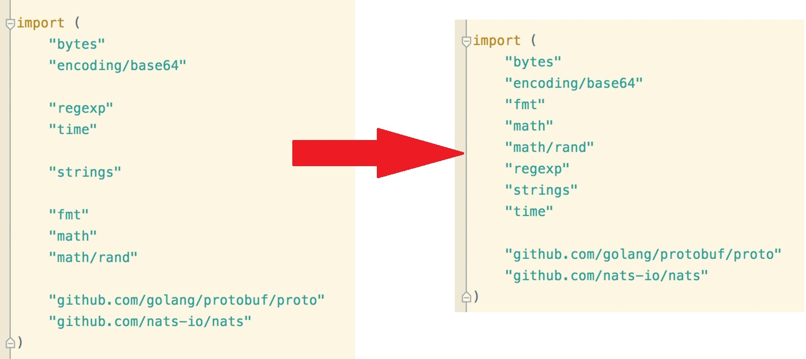
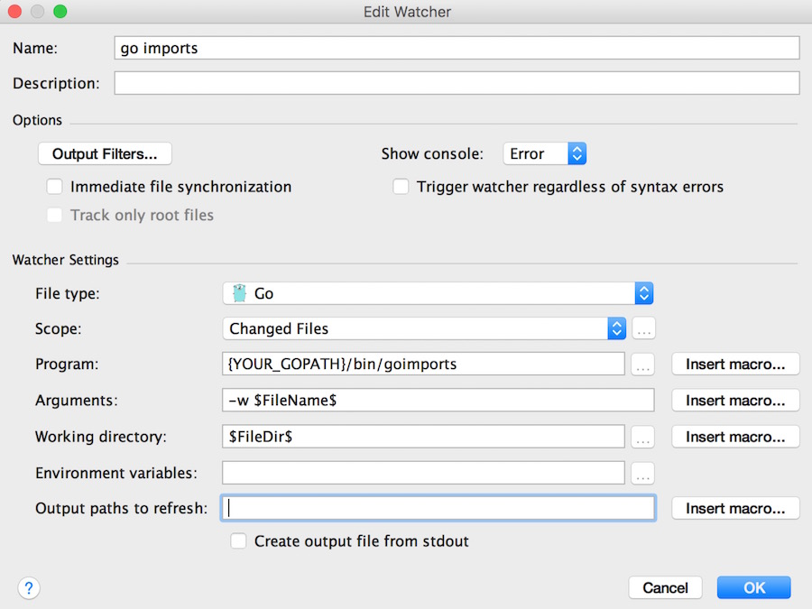

# goimports

This tool updates your Go import lines, adding missing ones and removing unreferenced ones.

It acts the same as gofmt (same flags, etc), but in addition to code formatting, also fixes imports.


Improved [bradfitz/goimports](https://github.com/bradfitz/goimports), better style like the following screenshot.



# install

run the following command:

```sh
$ go get github.com/ishare/goimports
```

For more usage guide, type `goimports --help`.

# intellij plugin

Config for `File Wathcer` plugin, which can be downloaded from intellij repo.




Happy hacking!
